# Mathematica 基本例程

推荐 Mathematica 版本: 14.0

## 内含:

1. 基本公式运算
2. 复数计算
3. 求极限, 求导, 偏导数
4. 积分, 多重积分, 曲线积分
5. 画二维/三维函数图, 画交互式函数图
6. 解方程, 解不等式, 解微分方程
7. 多项式化简, 分解因式, 消元, 展开表达式, 泰勒展开, 傅里叶展开
8. 级数展开与求解
9. 分段函数
10. 矩阵与行列式 
11. 统计学相关
12. 图像的傅里叶变换

## 图片

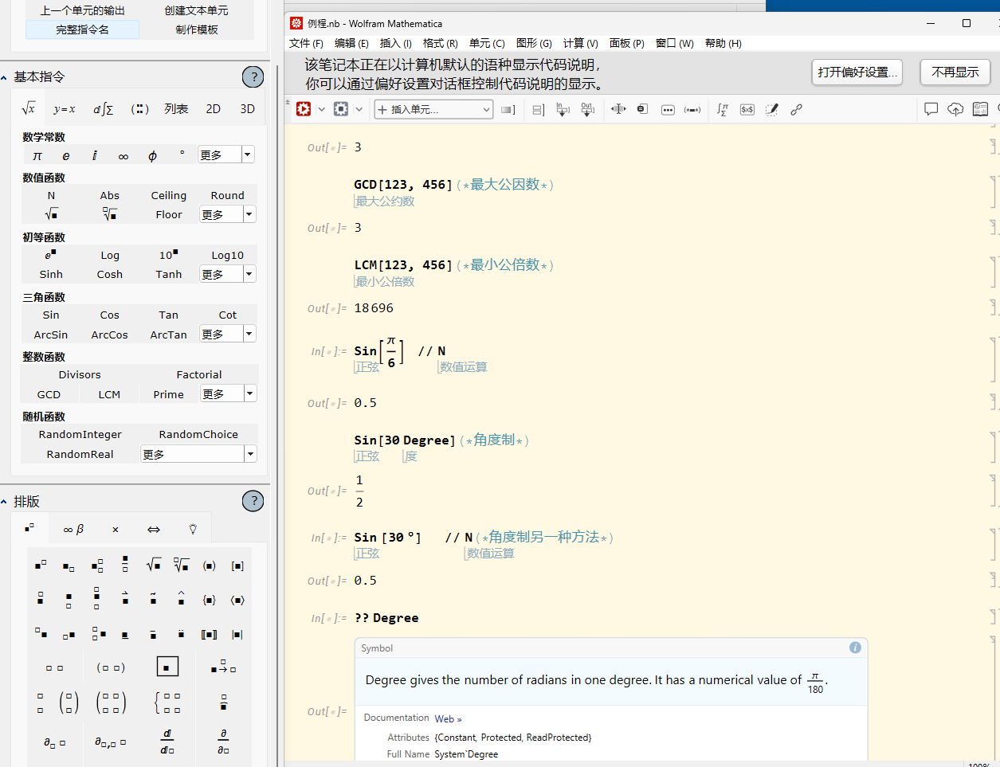

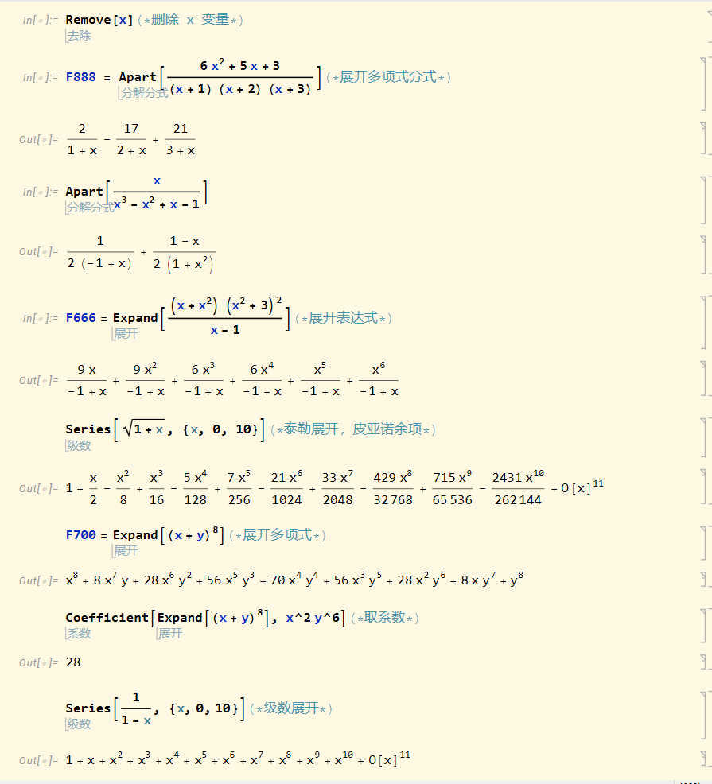

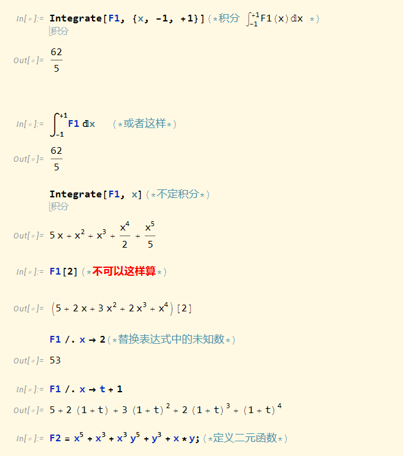

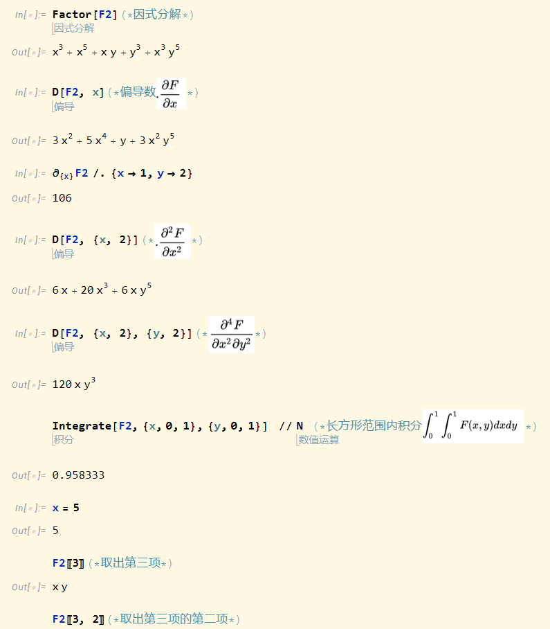

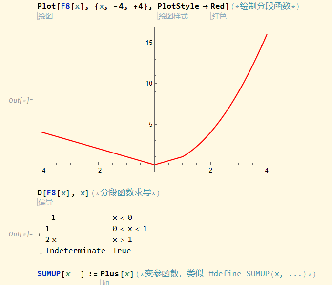

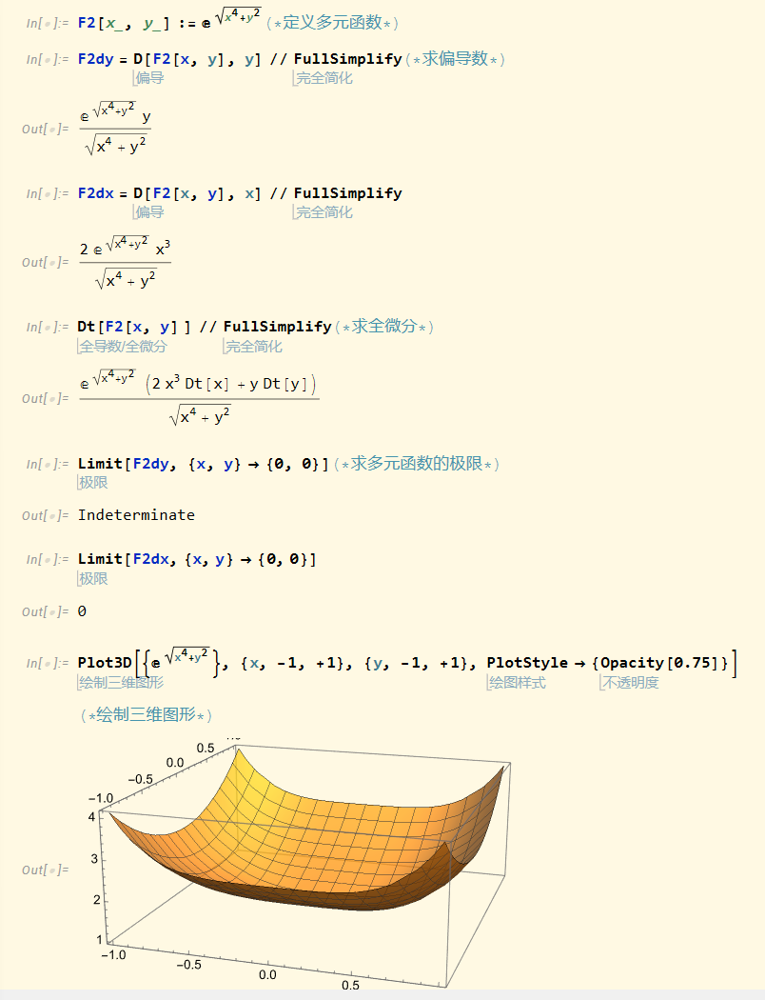

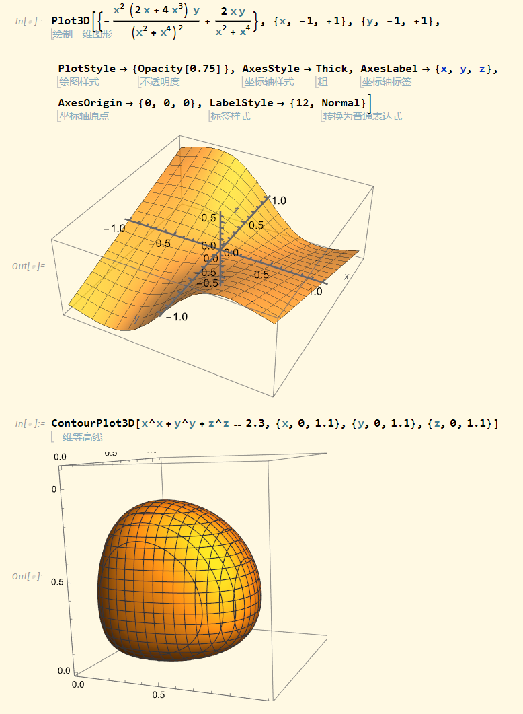

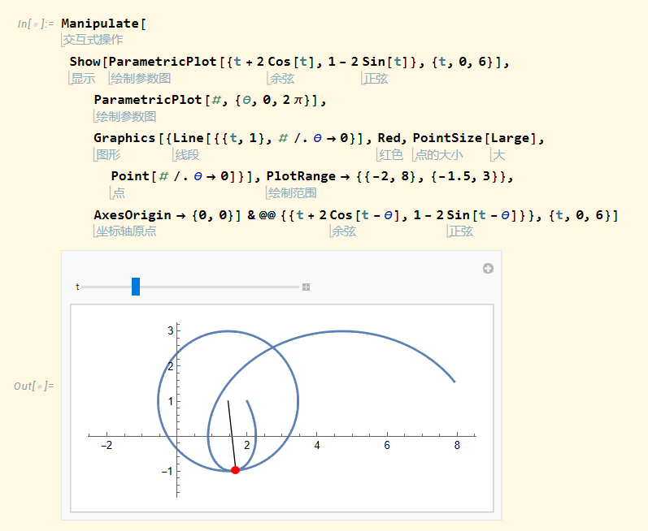

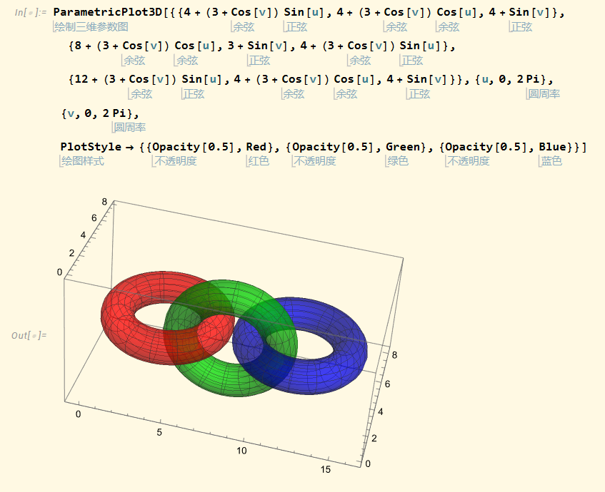

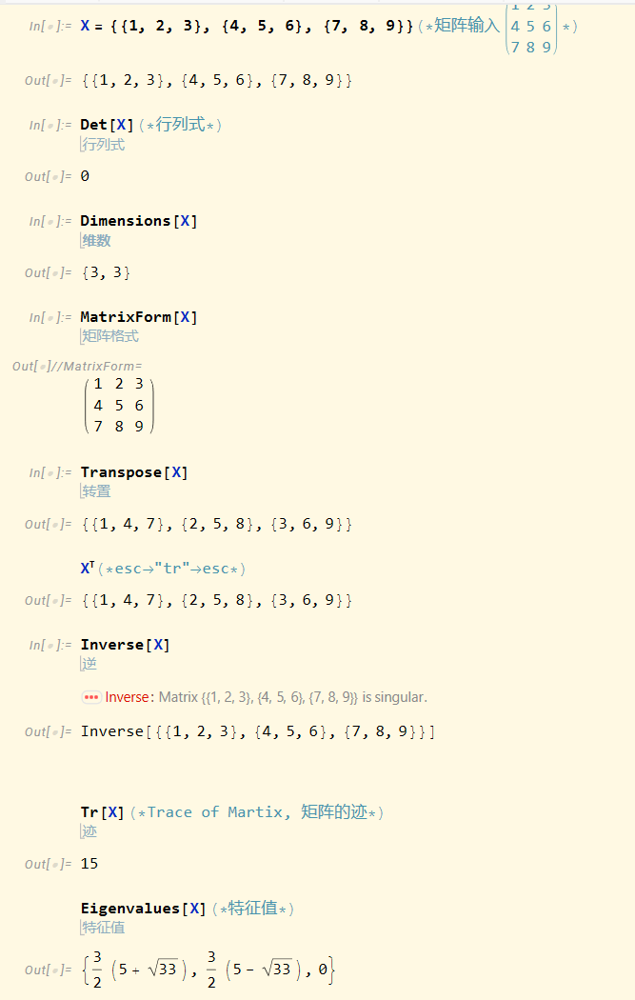

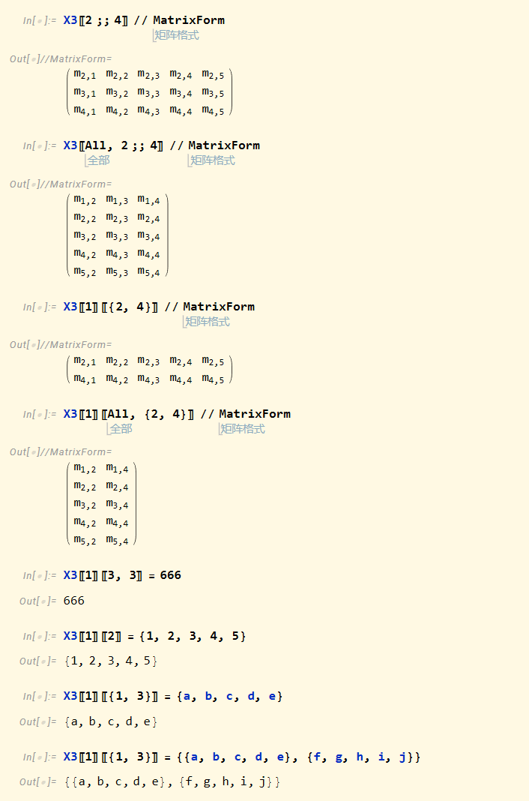

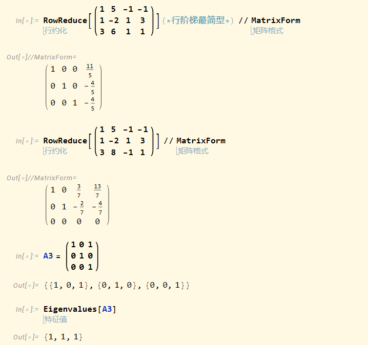

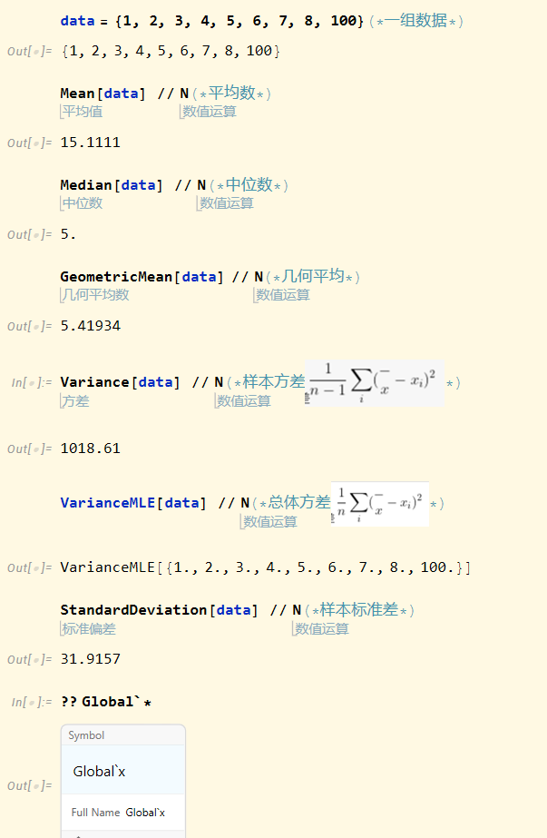
